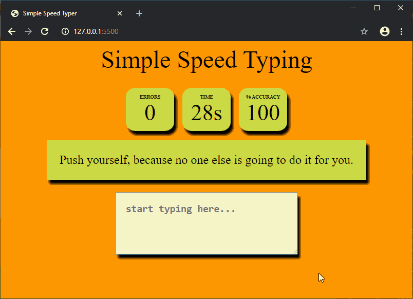

# js-simple-typing-game

This is a typing game created using HTML, CSS and JavaScript that can be run in the browser.

A guide was written for the GeeksForGeeks Technical Scripter contest where the process is described and the code is explained. Check out: [Design a typing speed test game using JavaScript](https://www.geeksforgeeks.org/design-a-typing-speed-test-game-using-javascript/)

## Demonstration

